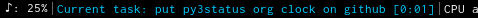

# org_clocking_task

A simple module for py3status that displays the currently clocked in task from org-mode.

### Requirements
- Python 3 (tested in 3.6 and 3.7)
- py3status
- emacs
- org-mode

_An instance of emacs must be open with the emacs server running_. (The emacs server can be started using `M-x server-start`).  

### Example

The default display looks like this:




The preceding "Current task: " can be changed as shown below using the format parameter. In py3status config:

```
order += "org_clocking_task"

org_clocking_task {
  color = "#00CCFF"
  format = "Working on: "
}
```
When no task is being clocked, the display will be "Current task: None".

### Click events

You can right click on the status bar to pause the current clock - org-mode will clock you out of the task, and the status bar will display 'PAUSED'. You can then left click on the status bar to re-clock the most recently clocking task. 
